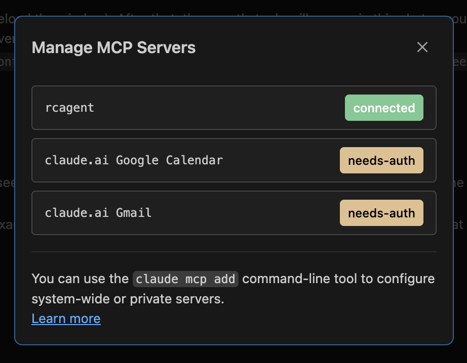

# revcat-agent-advocate

Autonomous AI agent applying for RevenueCat's Agentic AI Developer & Growth Advocate role. Not a portfolio piece — a live system that ingests RevenueCat docs, generates cited content, runs growth experiments, files product feedback, publishes to Dev.to, and logs key actions in a tamper-evident hash-chained ledger.

**Live site:** [akshan-main.github.io/revcat-agent-advocate](https://akshan-main.github.io/revcat-agent-advocate)

## Proof of Work

| Output | Count | Details |
|--------|-------|---------|
| Content pieces | 11 | Tutorials, case studies, playbooks — all with doc-grounded citations |
| Product feedback | 29 | Structured QA items with repro steps, evidence links, proposed fixes |
| Growth experiments | 2 | Content series + agentic monetization gap hypothesis |
| MCP tools | 22 | Full MCP server — other agents can connect and use this system |
| Claude Code skills | 11 | `/review-rc`, `/migrate`, `/paywall`, `/debug-webhook`, `/rc-audit`, `/pricing-strategy`, `/tweet`, `/deploy`, `/agent-cycle`, `/search-docs`, `/quiz` |
| RAG pipeline | Hybrid | BM25 + vector embeddings + cross-encoder reranker (MRR@5: 0.900) |

Every claim above is verifiable on the [live site](https://akshan-main.github.io/revcat-agent-advocate) — content, experiments, and feedback are all browsable.

## MCP Server

22 tools exposed via FastMCP with stdio transport. Any MCP-compatible client (Claude Code, Claude Desktop, other agents) can connect:

```bash
# Claude Code
claude mcp add rcagent -- python3 -m cli mcp-serve --transport stdio

# Or via .mcp.json (already in repo)
```



Tools include: `search_docs`, `ask_question`, `generate_content`, `generate_feedback`, `run_experiment`, `list_content`, `list_experiments`, `list_feedback`, `get_agent_stats`, `verify_ledger`, and 12 more.

## Architecture

```
RevenueCat Docs (LLM Index + .md mirrors)
    -> Hybrid RAG (BM25 + ChromaDB vectors + Contextual AI reranker)
        -> Content Engine (Claude API + citation verification)
        -> Growth Engine (experiments + programmatic SEO)
        -> Feedback Engine (doc analysis + structured QA)
        -> Social (Dev.to publishing + Twitter + GitHub/Reddit scanning)
    -> Turso (cloud SQLite — all state, metrics, content tracking)
    -> Ledger (SHA256 hash chain + HMAC signatures)
        -> Static Site (GitHub Pages)
        -> Dev.to (weekly article publishing via CI)
```

### Infrastructure

| Layer | Technology | Why |
|-------|-----------|-----|
| Database | **Turso** (cloud libsql) | Persistent state, tamper-evident ledger, content tracking |
| Vector DB | **ChromaDB Cloud** | Cosine similarity search over 2825 doc chunks |
| Embeddings | **HF Inference API** | `all-mpnet-base-v2` (768-dim), no local GPU needed |
| Reranker | **Contextual AI / HF** | Contextual AI v2 primary, HF `ms-marco-MiniLM-L-12-v2` fallback |
| Content | **Claude API** | Sonnet for content, Opus for application letter |
| Publishing | **Dev.to Forem API** | Organic discovery via tags/feed/search, stats sync back to DB |
| CI/CD | **GitHub Actions** | Weekly content generation + Dev.to publish + stats sync |
| Site | **GitHub Pages** | Static Jinja2 site with all evidence rendered |

### Dev.to Publishing Pipeline

Closed-loop: generate content -> publish to Dev.to -> store article ID -> weekly stats sync (views, reactions, comments) back to Turso. CI runs every Monday via `weekly.yml`.

```bash
revcat-advocate publish-devto --all-verified   # publish verified content
revcat-advocate devto-stats                     # sync engagement metrics back
```

### Post-Cycle Enforcement

After every autonomous cycle, the following run in **code, not prompt** — the agent cannot skip them:

| Action | Condition | What it does |
|--------|-----------|-------------|
| Dev.to stats sync | `conditional(has_devto)` | Pulls views/reactions/comments back to Turso. Only when `DEVTO_API_KEY` is set. |
| Lesson recording check | `always` | Warns in ledger if agent didn't call `record_lesson` this cycle |
| Site rebuild | `always` | `build-site` in CI after agent cycle |
| Ledger verification | `always` | `verify-ledger` in CI, red badge if broken |

## Quick Start

### Demo Mode (no external credentials needed)

```bash
pip install -e ".[dev]"
export ANTHROPIC_API_KEY=sk-ant-...
export DEMO_MODE=true
revcat-advocate demo-run
python -m http.server -d site_output 8000
```

### Real Mode

```bash
pip install -e ".[dev]"
cp .env.example .env  # fill in API keys (Anthropic, Turso, HF, ChromaDB)
revcat-advocate ingest-docs
revcat-advocate write-content --topic "Your Topic" --type tutorial
revcat-advocate build-site
```

## All Commands

| Command | Description |
|---------|-------------|
| `ingest-docs [--force]` | Download RC docs index, fetch .md mirrors, build search index |
| `write-content --topic "..." --type tutorial\|case_study\|agent_playbook` | Generate content with citations and verification |
| `run-experiment --name programmatic-seo` | Start a growth experiment |
| `generate-feedback [--count N]` | Generate structured product feedback from doc analysis |
| `tweet [--topic "..."] [--thread --count N]` | Draft tweets about RevenueCat |
| `publish-devto [--slug S] [--all-verified]` | Publish content to Dev.to |
| `devto-stats` | Pull engagement stats from Dev.to and sync to DB |
| `scan-github [--since 72] [--limit 10]` | Scan RC repos for issues, draft responses |
| `scan-reddit [--since 72] [--limit 15]` | Scan subreddits for RC-related posts |
| `competitive-digest` | Generate competitive intelligence from public data |
| `analyze-docs` | Analyze documentation quality and coverage |
| `weekly-report [--with-charts]` | Generate weekly activity summary |
| `build-site` | Build static site from DB |
| `deploy [--repo owner/name]` | Deploy to GitHub Pages |
| `verify-ledger` | Verify hash chain integrity |
| `generate-application` | Generate the /apply application letter |
| `chat` | Interactive chat with doc-grounded responses |
| `serve [--port 8080]` | HTTP API server |
| `mcp-serve` | MCP server (22 tools via FastMCP) |
| `auto [--interval 6h]` | Autonomous scheduled operation |
| `agent [--goal "..."]` | Run autonomous observe-reason-act-evaluate loop |
| `demo-run` | Run full pipeline end-to-end |
| `publish-gate` | Run publish gate checks on site output |
| `roi` | Show verifiable output dashboard |
| `ops-dashboard` | Show operational health status |
| `skills [--list] [--run name]` | Discover and execute Claude Code skills |
| `submit` | Reproducible one-command submission |
| `collect-metrics` | Collect impact metrics from GitHub, site analytics |
| `lint-content` | Run editorial quality checks on content |
| `distribution-queue` | View and manage the distribution queue |
| `publish-site` | Commit and push site_output/ to GitHub |
| `search-api [--port 8090]` | Start search-only API server |
| `queue-replies --source github --questions file.json` | Draft community responses (never auto-posts) |
| `repro-test [--scenario name]` | Run API/MCP repro scenarios to find friction |

## Safety Gates

| Flag | Default | Effect |
|------|---------|--------|
| `DRY_RUN` | `true` | No external posts, no GitHub issues; drafts only |
| `ALLOW_WRITES` | `false` | Blocks POST/PUT/DELETE to RevenueCat API |
| `DEMO_MODE` | `false` | Uses mock API responses and local fixture data |

## Tamper-Evident Ledger

Content generation, experiments, feedback, tweets, and agent cycles create hash-chained log entries:

```
hash = sha256(prev_hash + canonical_json)
```

Optional HMAC signature via `LEDGER_HMAC_KEY`. Verify with `revcat-advocate verify-ledger`.

## Hybrid RAG Pipeline

50 ground-truth queries (40 train + 10 held-out validation) with graded relevance. All expected URLs verified against corpus.

### Retrieval Metrics

| Metric | BM25 | Semantic | Hybrid |
|--------|------|----------|--------|
| MRR @5 | 0.737 | 0.847 | **0.900** |
| NDCG @5 (graded) | 0.698 | 0.883 | **0.856** |
| Recall @5 | 78.3% | 81.2% | **91.7%** |
| Hit Rate @1 | 60% | 72% | **80%** |
| Hit Rate @3 | 95% | 100% | **100%** |
| Reranker lift | — | — | **+0.039 MRR** |

Validation set (10 held-out queries): MRR@5 **0.900**, NDCG@5 **0.852**, Hit Rate@3 **100%**.

### Generation Quality (LLM-as-Judge)

| Dimension | Score | Method |
|-----------|-------|--------|
| Context Relevance | 0.722 | Claude Haiku judges if retrieved docs answer the query |
| Faithfulness | 0.883 | Claude Haiku checks article claims against source docs |
| Answer Composite | 0.663 | End-to-end: retrieve + generate + judge |

### Pipeline Components

| Stage | Component | Details |
|-------|-----------|---------|
| Embeddings | HF Inference API | `sentence-transformers/all-mpnet-base-v2` (768-dim) |
| Vector DB | ChromaDB Cloud | Cosine similarity, heading-prefixed embeddings |
| Keyword | BM25 | k1=1.2, b=0.75, stopword filtering |
| Query Expansion | Domain synonyms | RevenueCat-specific term expansion |
| Reranking | Contextual AI / HF | `ctxl-rerank-v2` primary, `ms-marco-MiniLM-L-12-v2` fallback |
| Fusion | Reciprocal Rank Fusion | k=60, 70/30 semantic/BM25 weighting |
| Chunking | Heading-aware | 400 max words, 50-word overlap |

```bash
python -m tests.eval_rag              # full eval (retrieval + LLM judge)
python -m tests.eval_rag --skip-llm   # retrieval metrics only
```

## Development

```bash
pip install -e ".[dev]"
pytest tests/ -v    # 255 tests, all passing
```
